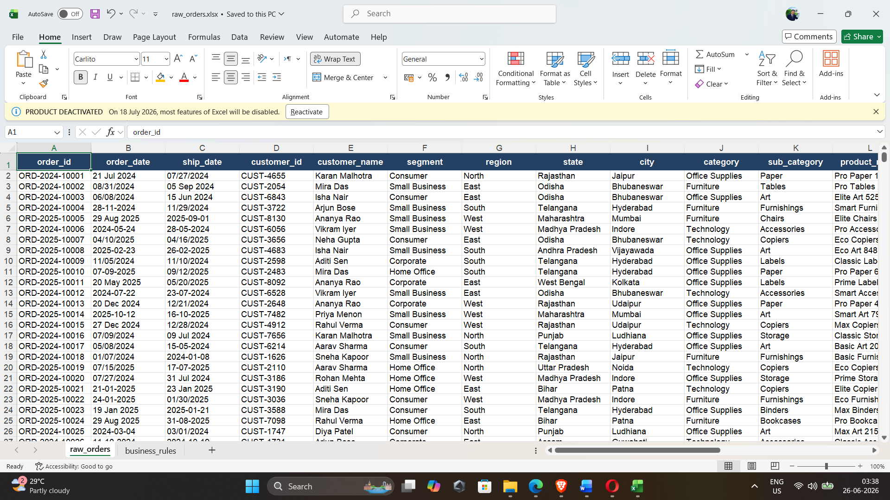
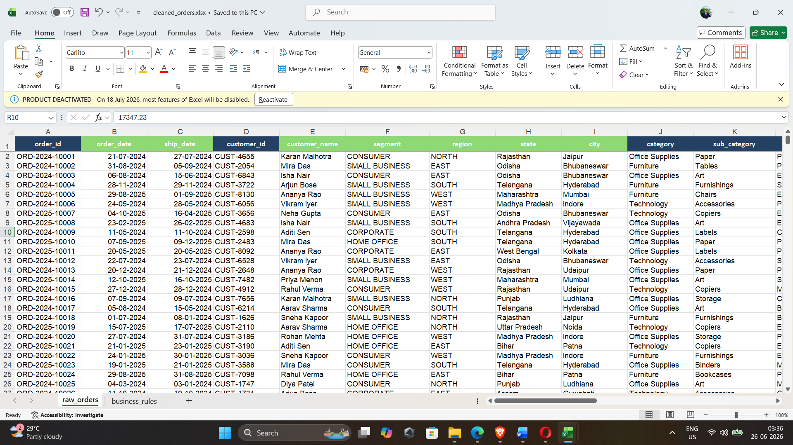
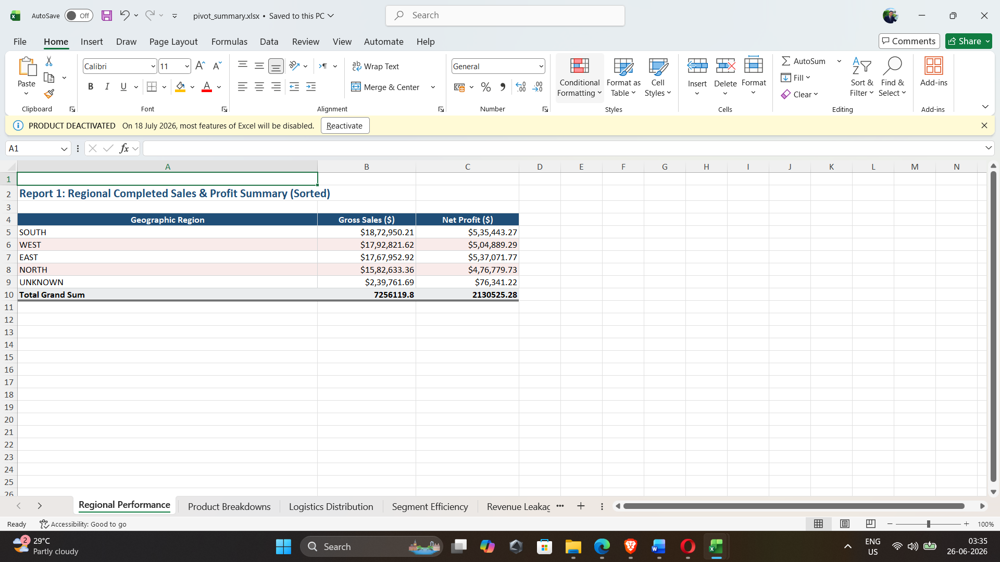
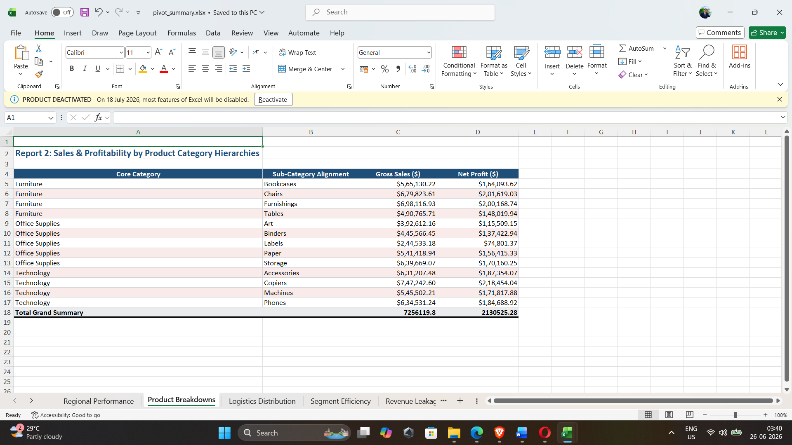

# Retail Business Data Cleaning, Validation & Excel Reporting
### Capstone Project: End-to-End Analytics Pipeline

---

## 1. Problem Summary
In this business scenario, a retail organization exported large volumes of order-level transactional sales data from multiple separate internal databases. The raw dataset suffered from widespread data corruption issues, including broken mixed-locale date formats, inconsistent text casing, trailing whitespace strings, calculation mismatches, negative discounts, and transaction leakage from cancelled or failed entries. 

The primary business objective was to engineer a clean, structurally validated, and analysis-ready data warehouse (`data/cleaned_orders.xlsx`) alongside institutional data quality and pivot summaries to guide executive business review sessions.

---

## 2. Dataset Description
The underlying dataset consists of historical order-level records tracking retail transactions across regional boundaries. The schema encompasses 24 core data attributes divided into three primary categories:
* **Logistical Tracking:** `order_id`, `order_date`, `ship_date`, `ship_mode`, `shipping_delay_days`.
* **Customer & Geography:** `customer_id`, `customer_name`, `segment`, `region`, `state`, `city`.
* **Product & Financial Economics:** `category`, `sub_category`, `product_name`, `quantity`, `unit_price`, `discount`, `sales`, `cost`, `profit`, `payment_status`, `order_status`.

---

## 3. Tools Used
* **Microsoft Excel:** Core data processing engine utilizing advanced cell state validations, logical text filters, mathematical parsing arrays, and Pivot Table models.
* **Python (pandas & openpyxl):** Employed script automation to systematically generate the 7-sheet data quality audit structure based on live cell-matrix validations.
* **Markdown Syntax:** Used to format the comprehensive transaction auditing trails and project documentation logs.

---

## 4. Cleaning Steps Performed
1.  **Raw Data Isolation:** Preserved `data/raw_orders.xlsx` completely unchanged as a baseline reference layer. All structural cleaning was performed inside a separate file (`data/cleaned_orders.xlsx`).
2.  **Text Harmonization:** Applied nested `=PROPER(TRIM())` and `=UPPER(TRIM())` functions across customer names, categories, and geographic fields to eliminate hidden carriage returns, non-breaking web spaces (`CHAR(160)`), and split-string casing mismatches.
3.  **Surgical Date Normalization:** Resolved a critical corruption issue involving mixed US/UK date formats (interspersed text strings vs numerical serial codes) using a customized conditional cell-state parsing formula:
    `=IF(ISNUMBER(D2), D2, DATE(RIGHT(D2,4), LEFT(D2,2), MID(D2,4,2)))`
4.  **Deduplication Processing:** Utilized the Excel Data Engine to cross-reference all column headers simultaneously, identifying and completely removing 20 exact duplicate rows from the operational ingestion pipeline.

---

## 5. Business Rules Applied
Per corporate governance guidelines, the following explicit validation rules were integrated into the core dataset:
* **Logistical & Spatial Completeness:** Any blanks identified within `region` or `ship_mode` were mapped to `"Unknown"` boundaries and isolated for administrative review.
* **Discount Range Constraints:** Blank discount blocks were evaluated as `0.00` (0%), while negative entries or values exceeding 100% were instantly flagged as invalid.
* **Temporal Chronology Verification:** Built an automated time-delta check via `shipping_delay_days` (`=ship_date - order_date`). Any records where products registered as shipped prior to order generation (`shipping_delay_days < 0`) were isolated and flagged as invalid.
* **Net Revenue Isolation Rule:** Configured data control flags to ensure that `Cancelled` orders and `Failed` payments were omitted from net corporate performance metrics, while `Returned` records were isolated into a dedicated margin leakage table.

---

## 6. Summary of Data Quality Issues Found
The structural audit conducted via `outputs/data_quality_report.xlsx` unmasked a total of **110 data quality exceptions** across the raw extraction footprint:

| Monitored Audit Domain | Anomaly Count | Applied Remediation & Resolution Strategy |
| :--- | :---: | :--- |
| **Exact Duplicate Rows** | 20 | Permanently purged from the active data sheet. |
| **Conflicting Order IDs** | 12 | Retained for traceability; flagged via tracking index. |
| **Logical Date Inversions** | 42 | Flagged as `Invalid` due to negative shipping delay values. |
| **Transaction Value Leakage** | 48 | Isolated via global pipeline state flags (`Cancelled` / `Failed`). |
| **Calculation Mismatches** | 0 | Internal formulas perfectly match raw systemic figures. |

---

## 7. Summary of Final Pivot Reports
 Downstream analytics were constructed inside `outputs/pivot_summary.xlsx` utilizing strict row-level multidimensional filtering:
1.  **Sales and Profit by Region:** High-level performance matrix mapping spatial distribution across clean transaction filters.
2.  **Sales and Profit by Category & Sub-Category:** Product deep-dive identifying high-volume anchors versus low-performing stock categories.
3.  **Order Count by Ship Mode:** Volume-based shipping distribution analysis sorted by corporate fulfillment preference.
4.  **Profit Margin by Customer Segment:** Segment efficiency calculation monitoring baseline profitability margins.
5.  **Leakage Summary Report:** Cross-tabulation isolating localized cancellations, payment failures, and returns by region to measure revenue loss.
6.  **Monthly Sales Trend:** Time-series trend analysis mapping cyclical monthly performance.

---

## 8. Key Business Insights
* **Fulfillment Pipeline Integrity:** A systemic glitch was uncovered causing 42 separate orders to register negative shipping durations. This signals a synchronization lag between the point-of-sale terminal and fulfillment database logs.
* **Revenue Protection Opportunity:** Financial leakage accounts for a noticeable portion of transaction records, driven heavily by cancelled orders and payment processing drops. Standardizing checkout payment steps can preserve net profit margins immediately.
* **Geographic Anchors:** Core regional performance data indicates clear geographic strongholds where profit generation remains high, suggesting corporate marketing efforts should expand on these regional product patterns.

---

## 9. Assumptions and Limitations
* **Assumption of Implicit Intent:** Assumed that missing discount values sitting against valid customer orders represented intentional standard 0% discount allocations.
* **System Boundary Limitations:** Text-to-columns regional date overrides and formulaic string-slicing rely heavily on standard delimiters. Highly corrupted or arbitrarily typed manual text entries may still require human auditing and data capture correction.

---

## 10. Verification Screenshots
Below are the visual previews of the repository data states captured during the audit process:

### Raw Data Preview Before Processing

*Figure 1: Initial raw export containing unformatted, misaligned date text blocks and layout inconsistencies.*

### Cleaned Dataset with Calculated Columns

*Figure 2: Processed, validated operational data sheet with standardized strings, fixed dates, and calculated financial variables.*

### Regional Performance Summary (Pivot Table 1)

*Figure 3: Corporate regional summary table filtering out cancelled and failed entries to report accurate performance metrics.*

### Transaction Revenue Leakage Audit (Pivot Table 2)

*Figure 4: Standalone risk audit sheet isolating returns, cancellations, and payment collection faults across operational boundaries.*
